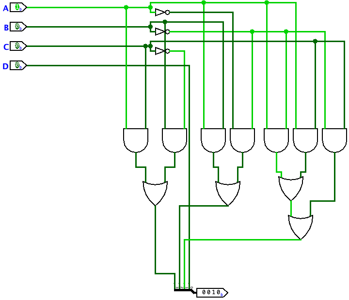

# LR 4

## Задание 1

 Сумматор - это устройство, предназначенное для арифметического сложения двух чисел. По известному правилу сложения многоразрядных двоичных чисел каждый разряд суммы формируется из разрядов слагаемых и переноса из младшего разряда. Кроме этого, формируется перенос в старший разряд. Самый простой сумматор - это одноразрядный сумматор.

### Таблица истинности сумматора

| A | B | C | S | P |
| - | - | - | - | - |
| 0 | 0 | 0 | 0 | 0 |
| 0 | 0 | 1 | 1 | 0 |
| 0 | 1 | 0 | 1 | 0 |
| 0 | 1 | 1 | 0 | 1 |
| 1 | 0 | 0 | 1 | 0 |
| 1 | 0 | 1 | 0 | 1 |
| 1 | 1 | 0 | 0 | 1 |
| 1 | 1 | 1 | 1 | 1 |

В данной таблице A и B - слагаемые,

С - перенос из младшего разряда, S - сумма,

P - перенос в старший разряд

### СКНФ по таблице

На основании полученной таблицы можно получить 2 СКНФ: По S и по P соответсвенно

#### 1. (A+B+C)\*(A+B+!C)\* (A+!B+C)\*(!A+B+C) ->(A+B)\*(A+C)\*(B+C)

#### 2. (!A+C+!B)\*(!A+!C+B)\*(A+!C+!B)\*(C+B+A) -> не сокращается

Минимизацию данных  СКНФ  можно проверить воспользовавшись расчетно-табличным методом из [LR3](https://github.com/ardonplay/AOIS/tree/master/lr3 "LR3"):

*(A+B+!C)*(A+!B+C)*(!A+B+C)")

*(!A+!C+B)*(A+!C+!B)*(C+B+A)")

### Синтез схемы сумматора

На изображении ниже представлена уже готовая схема одноразрядного двоичного сумматора на 3 входа (ОДС-3) с представлением выходных функций в СКНФ.

### Синтез схемы 8-битного сумматора

Для синтеза такого сумматора, нам надо "склеить" 8 обычных сумматоров.

Готовая схема представлена ниже.

## Задание 2

    Цель: синтез преобразователя тетрад десятично двоичного кода Д8421 в код Д8421+4 как устройства с не полностью определенными функциями. 

Для решения данной задачи нам потребуется так же построить таблицу истинности на 4 переменных.

### Таблица истинности

| A | B | C | D |   | Y1| Y2| Y3| Y4|
| - | - | - | - | - | - | - | - | - |
| 0 | 0 | 0 | 0 |   | 0 | 1 | 0 | 0 |
| 0 | 0 | 0 | 1 |   | 0 | 1 | 0 | 1 |
| 0 | 0 | 1 | 0 |   | 0 | 1 | 1 | 0 |
| 0 | 0 | 1 | 1 |   | 0 | 1 | 1 | 1 |
| 0 | 1 | 0 | 0 |   | 1 | 0 | 0 | 0 |
| 0 | 1 | 0 | 1 |   | 1 | 0 | 0 | 1 |
| 0 | 1 | 1 | 0 |   | 0 | 0 | 0 | 0 |
| 0 | 1 | 1 | 1 |   | 0 | 0 | 0 | 1 |
| 1 | 0 | 0 | 0 |   | 0 | 0 | 1 | 0 |
| 1 | 0 | 0 | 1 |   | 0 | 0 | 1 | 1 |
| 1 | 0 | 1 | 0 |   | 1 | 0 | 1 | 0 |
| 1 | 0 | 1 | 1 |   | 1 | 0 | 1 | 1 |
| 1 | 1 | 0 | 0 |   | 1 | 1 | 0 | 0 |
| 1 | 1 | 0 | 1 |   | 1 | 1 | 0 | 1 |
| 1 | 1 | 1 | 0 |   | 1 | 1 | 1 | 0 |
| 1 | 1 | 1 | 1 |   | 1 | 1 | 1 | 1 |

В данной таблице A,B,C,D - входные тетрады,

Y1, Y2, Y3, Y4 - выходные тетрады.

### СДНФ по таблице

На основании полученной таблицы можно получить 4 СДНФ: По Y1, Y2, Y3, Y4 соответсвенно

#### 1. (!A\\*B\*!C\*!D)+(!A\*B\*!C\*D)+(A\*!B\*C\*!D)+(A\*!B\*C\*D)+(A\*B\*!C\*!D)+(A\*B\*!C\*D)+(A\*B\*C\*!D)+(A\*B\*C\*D) -> (A\*C)+(B\*!C)

#### 2. (!A\*!B\*!C\*!D)+(!A\*!B\*!C\*D)+(!A\*!B\*C\*!D)+(!A\*!B\*C\*D)+(A\*B\*!C\*!D)+(A\*B\*!C\*D)+(A\*B\*C\*!D)+(A\*B\*C\*D) -> (A\*B)+(!A\*!B)

#### 3. (!A\*!B\*C\*!D)+(!A\*!B\*C\*D)+(A\*!B\*!C\*!D)+(A\*!B\*!C\*D)+(A\*!B\*C\*!D)+(A\*!B\*C\*D)+(A\*B\*C\*!D)+(A\*B\*C\*D) -> (A\*!B)+(A\*C)+(!B\*C)

#### 4. (!A\*!B\*!C\*D)+(!A\*!B\*C\*D)+(!A\*B\*!C\*D)+(!A\*B\*C\*D)+(A\*!B\*!C\*D)+(A\*!B\*C\*D)+(A\*B\*!C\*D)+(A\*B\*C\*D) -> D

Минимизацию данных СДНФ можно также проверить воспользовавшись расчетно-табличным методом из [LR3](https://github.com/ardonplay/AOIS/tree/master/lr3 "LR3"):

+(!A*B*!C*D)+(A*!B*C*!D)+(A*!B*C*D)+(A*B*!C*!D)+(A*B*!C*D)+(A*B*C*!D)+(A*B*C*D)")

+(!A*!B*!C*D)+(!A*!B*C*!D)+(!A*!B*C*D)+(A*B*!C*!D)+(A*B*!C*D)+(A*B*C*!D)+(A*B*C*D)")

+(!A*!B*C*D)+(A*!B*!C*!D)+(A*!B*!C*D)+(A*!B*C*!D)+(A*!B*C*D)+(A*B*C*!D)+(A*B*C*D)")

+(!A*!B*C*D)+(!A*B*!C*D)+(!A*B*C*D)+(A*!B*!C*D)+(A*!B*C*D)+(A*B*!C*D)+(A*B*C*D)")

### Cинтез преобразователя

На изображении ниже представлена уже готовая схема данного преобразователя

## Все схемы представленные здесь можно проверить и испытать, открыв файл [lr4.circ](https://github.com/ardonplay/AOIS/tree/master/lr4/lr4.circ "lr4.circ")
