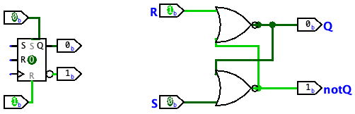
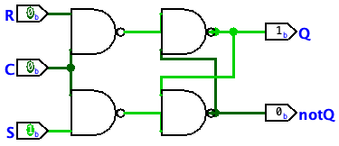

# LR 5

## Синтез цифровых автоматов

## Цель

Повторение и закрепление материала по синтезу схем с памятью – цифровых автоматов, освоение навыков по синтезу схем с памятью.

## Содержание

1.[Теория](#теория)

2.[Практика](#практика)

## Теория

Рассматриваемые в данной лабораторной работе схемы с памятью называются триггерами.

### Триггер

Триггером называют электронное устройство, обладающее способностью довольно долгое время находиться в 1-ом из 2-х стабильных состояний, а так же чередовать их из-за воздействия какого-то внешнего сигнала. Триггер — это по сути простая электроника, от которой зависит работоспособность более сложных систем

Существует 4 основных вида триггеров:

1. [RS-триггер](#rs-триггер)
2. [D-триггер](#d-триггер)
3. [T-триггер](#t-триггер)
4. [JK-триггер](#jk-триггер)

### RS-триггер

RS-триггеры являются самыми простыми и базовыми триггерами. Они состоят из двух элементов ИЛИ-НЕ, связанных обратной связью. RS-триггер имеет два входа - установка (S) и сброс (R), которые определяют его состояние и позволяют управлять изменением его выходного сигнала.

Стоит отметить, что запрещающая установка для такого триггера - 0:0

Ниже приведена схема данного триггера

Также есть синхронная версия данного триггера

### D-триггер

D-триггер (от англ. delay), повторяющий на своем выходе состояние входа. Рассуждая чисто теоретически, D-триггер можно образовать из любых RS- или JK-триггеров, если на их входы одновременно подавать взаимно инверсные сигналы

Ниже приведена схемы данного триггера на элементах И-Нет и через синхронный RS триггер(RST)

### JK-триггер

JK-триггер (от англ. jump и keep), отличается от RS-триггера(состоящего из И-НЕТ элементов) тем, что появление на обоих информационных входах (J и К) логических единиц
(для прямых входов) приводит к изменению состояния триггера. Такая комбинация сигналов для JK-триггера не является запрещенной.

### T-триггер

T-триггер является модификацией JK-триггера, где вместо входов J и K используется один вход T (toggle). Вход T определяет, должно ли состояние триггера измениться на следующем такте.

## Практика

В данной лабораторной работе требуется синтезировать схему двоичного счетчика вычитающего типа на 16 внутренних состояний в базисе НЕ-И ИЛИ и Т-триггер

### Таблица истинности

|q1 | q2 | q3 | q4 | Такт(q5) | q1-old | q2-old |q3-old | q4-old | h1 | h2 | h3 | h4 |
| - | - | - | - | - | - | - | - | - | - | - | - | - |
| 0 | 0 | 0 | 0 | 0 | 0 | 0 | 0 | 0 | 0 | 0 | 0 | 0 |
| 1 | 1 | 1 | 1 | 1 | 0 | 0 | 0 | 0 | 1 | 1 | 1 | 1 |
| 1 | 1 | 1 | 1 | 0 | 1 | 1 | 1 | 1 | 0 | 0 | 0 | 0 |
| 0 | 1 | 1 | 1 | 1 | 1 | 1 | 1 | 1 | 1 | 0 | 0 | 0 |
| 0 | 1 | 1 | 1 | 0 | 0 | 1 | 1 | 1 | 0 | 0 | 0 | 0 |
| 1 | 0 | 1 | 1 | 1 | 0 | 1 | 1 | 1 | 1 | 1 | 0 | 0 |
| 1 | 0 | 1 | 1 | 0 | 1 | 0 | 1 | 1 | 0 | 0 | 0 | 0 |
| 0 | 0 | 1 | 1 | 1 | 1 | 0 | 1 | 1 | 1 | 0 | 0 | 0 |
| 0 | 0 | 1 | 1 | 0 | 0 | 0 | 1 | 1 | 0 | 0 | 0 | 0 |
| 1 | 1 | 0 | 1 | 1 | 0 | 0 | 1 | 1 | 1 | 1 | 1 | 0 |
| 1 | 1 | 0 | 1 | 0 | 1 | 1 | 0 | 1 | 0 | 0 | 0 | 0 |
| 0 | 1 | 0 | 1 | 1 | 1 | 1 | 0 | 1 | 1 | 0 | 0 | 0 |
| 0 | 1 | 0 | 1 | 0 | 0 | 1 | 0 | 1 | 0 | 0 | 0 | 0 |
| 1 | 0 | 0 | 1 | 1 | 0 | 1 | 0 | 1 | 1 | 1 | 0 | 0 |
| 1 | 0 | 0 | 1 | 0 | 1 | 0 | 0 | 1 | 0 | 0 | 0 | 0 |
| 0 | 0 | 0 | 1 | 1 | 1 | 0 | 0 | 1 | 1 | 0 | 0 | 0 |
| 0 | 0 | 0 | 1 | 0 | 0 | 0 | 0 | 1 | 0 | 0 | 0 | 0 |
| 1 | 1 | 1 | 0 | 1 | 0 | 0 | 0 | 1 | 1 | 1 | 1 | 1 |
| 1 | 1 | 1 | 0 | 0 | 1 | 1 | 1 | 0 | 0 | 0 | 0 | 0 |
| 0 | 1 | 1 | 0 | 1 | 1 | 1 | 1 | 0 | 1 | 0 | 0 | 0 |
| 0 | 1 | 1 | 0 | 0 | 0 | 1 | 1 | 0 | 0 | 0 | 0 | 0 |
| 1 | 0 | 1 | 0 | 1 | 0 | 1 | 1 | 0 | 1 | 1 | 0 | 0 |
| 1 | 0 | 1 | 0 | 0 | 1 | 0 | 1 | 0 | 0 | 0 | 0 | 0 |
| 0 | 0 | 1 | 0 | 1 | 1 | 0 | 1 | 0 | 1 | 0 | 0 | 0 |
| 0 | 0 | 1 | 0 | 0 | 0 | 0 | 1 | 0 | 0 | 0 | 0 | 0 |
| 1 | 1 | 0 | 0 | 1 | 0 | 0 | 1 | 0 | 1 | 1 | 1 | 0 |
| 1 | 1 | 0 | 0 | 0 | 1 | 1 | 0 | 0 | 0 | 0 | 0 | 0 |
| 0 | 1 | 0 | 0 | 1 | 1 | 1 | 0 | 0 | 1 | 0 | 0 | 0 |
| 0 | 1 | 0 | 0 | 0 | 0 | 1 | 0 | 0 | 0 | 0 | 0 | 0 |
| 1 | 0 | 0 | 0 | 1 | 0 | 1 | 0 | 0 | 1 | 1 | 0 | 0 |
| 1 | 0 | 0 | 0 | 0 | 1 | 0 | 0 | 0 | 0 | 0 | 0 | 0 |
| 0 | 0 | 0 | 0 | 1 | 1 | 0 | 0 | 0 | 1 | 0 | 0 | 0 |

### СДНФ по таблице

На основании полученной таблицы можно получить 4 СДНФ: По h1, h2, h3, h4 соответсвенно

### 1.(!q1\*!q2\*!q3\*!q4\*q5)+(q1\*q2\*q3\*q4\*q5)+(!q1\*q2\*q3\*q4\*q5)+(q1\*!q2\*q3\*q4\*q5)+(!q1\*!q2\*q3\*q4\*q5)+(q1\*q2\*!q3\*q4\*q5)+(!q1\*q2\*!q3\*q4\*q5)+(q1\*!q2\*!q3\*q4\*q5)+(!q1\*!q2\*!q3\*q4\*q5)+(q1\*q2\*q3\*!q4\*q5)+(!q1\*q2\*q3\*!q4\*q5)+(q1\*!q2\*q3\*!q4\*q5)+(!q1\*!q2\*q3\*!q4\*q5)+(q1\*q2\*!q3\*!q4\*q5)+(!q1\*q2\*!q3\*!q4\*q5)+(q1\*!q2\*!q3\*!q4\*q5) -> q5

### 2.(!q1\*!q2\*!q3\*!q4\*q5)+(!q1\*q2\*q3\*q4\*q5)+(!q1\*!q2\*q3\*q4\*q5)+(!q1\*q2\*!q3\*q4\*q5)+(!q1\*!q2\*!q3\*q4\*q5)+(!q1\*q2\*q3\*!q4\*q5)+(!q1\*!q2\*q3\*!q4\*q5)+(!q1\*q2\*!q3\*!q4\*q5) -> (q5\*!q1)

### 3.(!q1\*!q2\*!q3\*!q4\*q5)+(!q1\*!q2\*q3\*q4\*q5)+(!q1\*!q2\*!q3\*q4\*q5)+(!q1\*!q2\*q3\*!q4\*q5) -> (q5\*!q2\*!q1)

### 4.(!q1\*!q2\*!q3\*!q4\*q5)+(!q1\*!q2\*!q3\*q4\*q5) -> (q5\*!q3\*!q2\*!q1)

Минимизацию данных СДНФ можно также проверить воспользовавшись расчетно-табличным методом из [LR3](https://github.com/ardonplay/AOIS/tree/master/lr3 "LR3"), для удобства заменим q1, q2, q3, q4, q5 на A,B, C, D, F соответсвенно:

Из полученных минимизаций можем синтезировать схему

### Cинтез

Построенная схема может выглядеть следующим образом

## Данную схему можно проверить и испытать, открыв файл [lr5.circ](./lr5.circ "lr5.circ")
